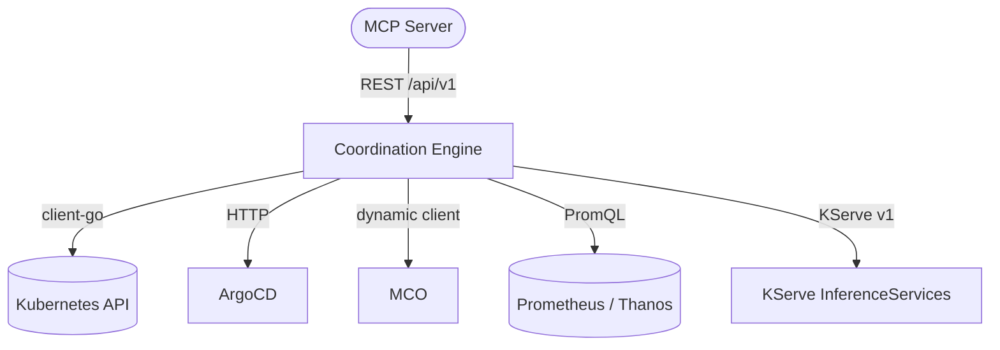

# Architecture

This file is a pointer to the full software design document.

For the complete arc42 architecture documentation, including system context, building block
views, runtime sequences, deployment diagrams, and crosscutting concepts, see
**[DESIGN_DOC.md](DESIGN_DOC.md)**.

For architectural decision records, see **[docs/adrs/README.md](docs/adrs/README.md)**.

## Quick reference

**Responsibilities:**

- **Coordination Engine** (this repo): Orchestration, remediation planning, multi-layer coordination.
- **KServe InferenceServices**: User-deployed ML models for anomaly detection and predictions.
- **MCP Server**: Natural language interface that consumes this engine via REST.

For details on each component, integration boundary, and quality requirement, read
[DESIGN_DOC.md](DESIGN_DOC.md).
