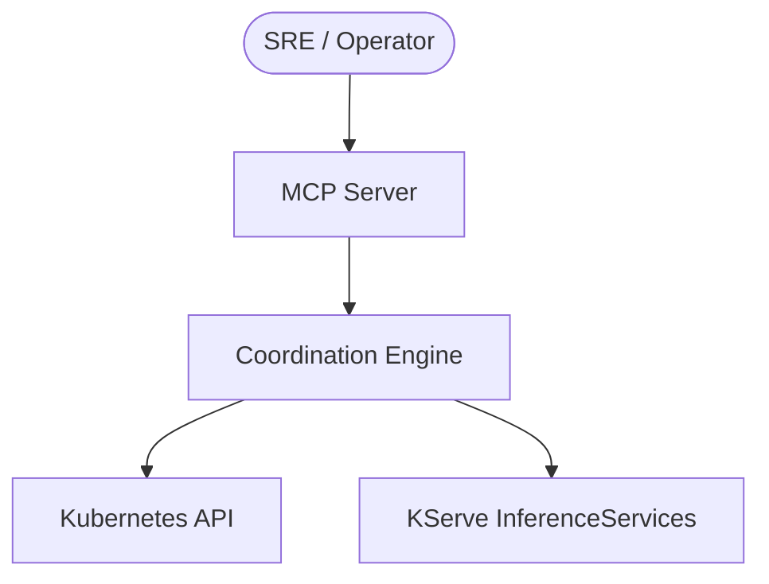
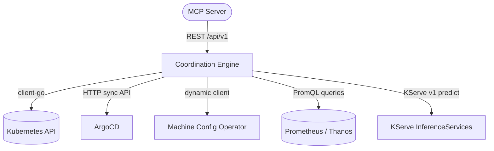
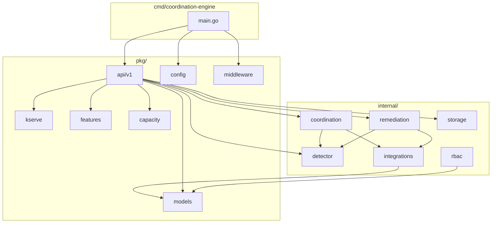
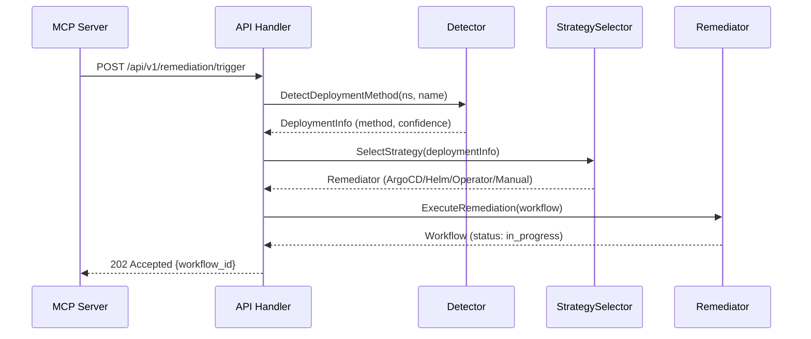
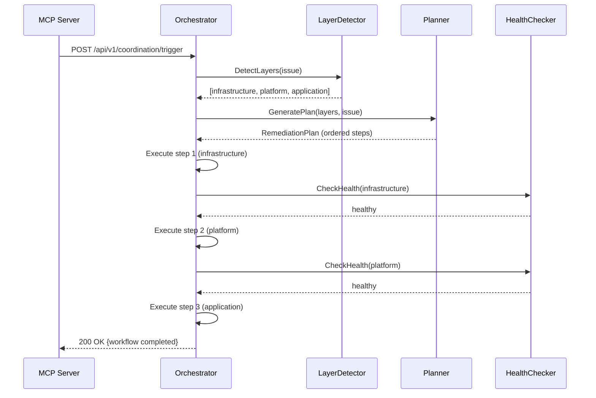
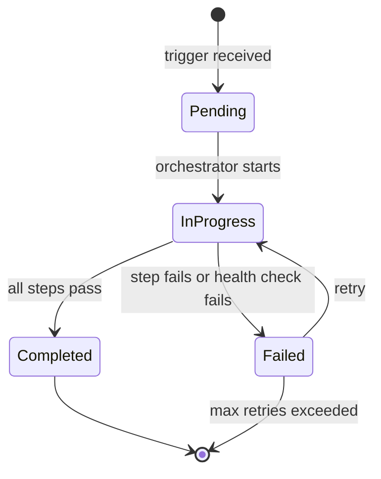
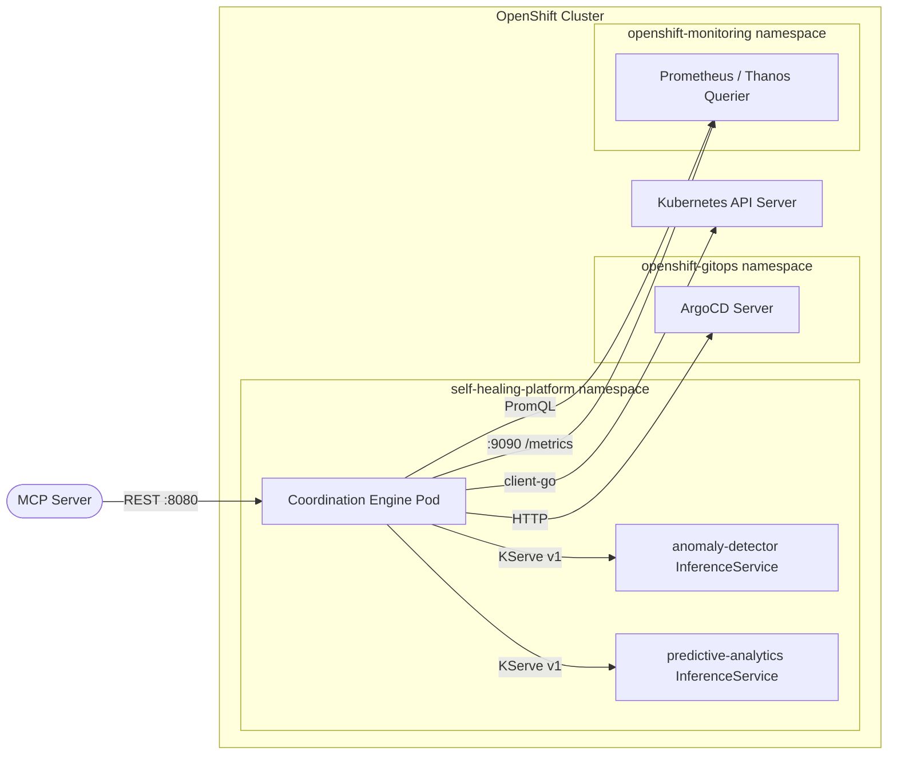

# DESIGN_DOC.md

**System:** OpenShift Coordination Engine
**Version:** 1.2.0
**Status:** Accepted
**Audience:** Architects, implementers, reviewers
**Voice:** STE100
**Related requirements:** [API-CONTRACT.md](API-CONTRACT.md), [docs/adrs/README.md](docs/adrs/README.md)

The OpenShift Coordination Engine is a Go service that orchestrates multi-layer remediation
across infrastructure, platform, and application tiers in OpenShift and Kubernetes clusters.
It detects deployment methods, selects the correct remediation strategy, and coordinates
recovery steps with health checkpoints between each layer.

This document follows the arc42 template. All 12 sections are present.

---

## 1. Introduction and goals

The engine replaces a Python coordination service while keeping the same REST API contract
consumed by the MCP (Model Context Protocol) server. It adds deployment-aware remediation,
multi-layer orchestration, and direct KServe integration for ML-based anomaly detection and
predictive analytics.

### 1.1 Quality goals

| ID | Goal | Scenario |
|----|------|----------|
| QG-1 | API compatibility | The MCP server calls the engine without code changes after the Python-to-Go migration. |
| QG-2 | Deployment awareness | The engine detects ArgoCD, Helm, Operator, or Manual deployment methods and applies the correct remediation strategy for each. |
| QG-3 | Graceful degradation | When the ML service or KServe is unavailable, the engine continues to accept remediation requests using rule-based fallback logic. |
| QG-4 | Observability | Every remediation workflow emits Prometheus metrics and structured JSON logs with a trace ID. |

### 1.2 Stakeholders

| Stakeholder | Expectation |
|-------------|-------------|
| SRE / on-call operator | Trigger remediation from the MCP chat interface and track workflow status. |
| Platform architect | Understand the building blocks, integration boundaries, and ADR rationale. |
| ML engineer | Verify the feature vector format and KServe v1 protocol compliance. |
| Contributor | Build, test, and extend the engine using the documented conventions. |



---

## 2. Constraints

- **Language:** Go 1.26 with `client-go` for all Kubernetes operations.
- **License:** Apache 2.0.
- **OpenShift versions:** Rolling 3-version window. Active: 4.20, 4.21, 4.22.
- **API contract:** Must maintain backward compatibility with the Python engine REST API so the MCP server requires no changes.
- **ML protocol:** KServe v1 prediction API (`POST /v1/models/{name}:predict`).
- **Team size:** Small team. The engine is a single deployable binary.
- **Runtime:** Runs as a Deployment in namespace `self-healing-platform` on OpenShift.

---

## 3. Context and scope

**In scope:** Deployment detection, multi-layer remediation orchestration, KServe ML integration, Prometheus-based anomaly detection, capacity forecasting, incident tracking.

**Out of scope:** ML model training, MCP server implementation, ArgoCD installation, Prometheus/Thanos deployment.



### External interfaces

| Interface | Protocol | Direction | Purpose |
|-----------|----------|-----------|---------|
| MCP Server | REST JSON | Inbound | Trigger remediation, query incidents and workflows |
| Kubernetes API | client-go | Outbound | Read/write pods, deployments, namespaces, RBAC checks |
| ArgoCD API | HTTP REST | Outbound | Sync applications, check sync status |
| MCO | Dynamic client | Outbound | Monitor MachineConfigPool stability |
| Prometheus/Thanos | HTTP PromQL | Outbound | Query CPU, memory, disk, network metrics |
| KServe | HTTP REST | Outbound | Anomaly detection and predictive analytics |

---

## 4. Solution strategy

The design follows these high-level decisions. Each links to a formal ADR.

| Decision | ADR | Rationale |
|----------|-----|-----------|
| Go with `client-go` and `gorilla/mux` | [ADR-001](docs/adrs/001-go-project-architecture.md) | Type safety, Kubernetes-native, single binary deployment |
| Priority-based deployment detection | [ADR-002](docs/adrs/002-deployment-detection-implementation.md) | ArgoCD (0.95) > Helm (0.90) > Operator (0.80) > Manual (0.60) |
| Infrastructure-first layer ordering | [ADR-003](docs/adrs/003-multi-layer-coordination-implementation.md) | Fix infrastructure before platform, platform before application |
| Strategy pattern for remediators | [ADR-005](docs/adrs/005-remediation-strategies-implementation.md) | Each deployment method gets its own `Remediator` implementation |
| KServe over legacy ML | [ADR-015](docs/adrs/015-kserve-inference-service-integration.md) | Standard protocol, user-deployed models, no custom ML service needed |
| Prometheus for real metrics | [ADR-014](docs/adrs/014-prometheus-thanos-observability-incident-management.md) | Months of history via Thanos, 45-feature vectors for ML |

---

## 5. Building block view

| Building block | Responsibility | ADR |
|----------------|----------------|-----|
| `cmd/coordination-engine` | Process entry, HTTP server, component wiring, graceful shutdown | ADR-001 |
| `internal/detector` | Deployment method detection with cache | ADR-002 |
| `internal/coordination` | Layer detection, planning, orchestration, health checks | ADR-003 |
| `internal/remediation` | Strategy selector, ArgoCD/Helm/Operator/Manual remediators | ADR-005 |
| `internal/integrations` | Clients for ArgoCD, MCO, Prometheus, KServe, legacy ML | ADR-004, ADR-009, ADR-014 |
| `internal/rbac` | Startup RBAC verification via SelfSubjectAccessReview | ADR-006 |
| `internal/storage` | In-memory and file-persisted incident store | ADR-014 |
| `pkg/api/v1` | REST API handlers (11 handler files) | ADR-011 |
| `pkg/models` | Shared domain types (7 model files) | ADR-001 |
| `pkg/config` | Environment-variable-based configuration | ADR-001 |
| `pkg/kserve` | KServe InferenceService proxy client | ADR-015 |
| `pkg/middleware` | Recovery, request logging, CORS | ADR-001 |
| `pkg/features` | ML feature engineering and Prometheus adapter | ADR-016 |
| `pkg/capacity` | Namespace/cluster capacity analysis and trend math | ADR-019 |



### 5.1 Directory tree

```text
openshift-coordination-engine/
  cmd/coordination-engine/main.go
  internal/
    coordination/    (6 files: layer_detector, ml_layer_detector, planner, orchestrator, health_checker, metrics)
    detector/        (3 files: deployment_detector, detector, metrics)
    integrations/    (5 files: argocd_client, kserve_client, mco_client, ml_client, prometheus_client)
    rbac/            (1 file:  verifier)
    remediation/     (8 files: orchestrator, strategy_selector, interfaces, 4 remediators, metrics)
    storage/         (1 file:  incidents)
  pkg/
    api/v1/          (11 files: health, remediation, detection, coordination, anomaly, prediction,
                      recommendations, capacity, diskexhaustion, rightsizing, kserve_proxy)
    capacity/        (2 files: analyzer, trending)
    config/          (1 file:  config)
    features/        (2 files: predictive, prometheus_adapter)
    kserve/          (1 file:  proxy)
    middleware/      (3 files: recovery, logging, cors)
    models/          (7 files: deployment_info, health, incident, issue, layered_issue,
                      remediation_plan, workflow)
  charts/coordination-engine/   (Helm chart)
  docs/adrs/                    (20 ADRs)
```

---

## 6. Runtime view

### 6.1 Remediation trigger flow



### 6.2 Multi-layer coordination flow



### 6.3 Workflow lifecycle



---

## 7. Deployment view



**Runtime details:**

- **Process model:** Single Go binary, statically linked (`CGO_ENABLED=0`).
- **Ports:** 8080 (API), 9090 (Prometheus metrics).
- **Image:** `quay.io/takinosh/openshift-coordination-engine:ocp-{version}-latest`.
- **Health probes:** `GET /health` (liveness/readiness).
- **Secrets:** `ARGOCD_TOKEN` (optional), `QUAY_USERNAME`/`QUAY_TOKEN` (CI only).
- **Persistent storage:** Optional file-based incident store via `DATA_DIR` environment variable.
- **Non-root:** Runs as UID 1001, group 0.

---

## 8. Crosscutting concepts

### Logging and tracing

The engine uses `logrus` with JSON formatting. Every HTTP request receives a unique
`X-Request-ID` header (auto-generated if not provided by the caller). The request logger
middleware records method, path, status code, and duration for each request.

### Authentication and authorization

The API does not implement its own authentication. Access control relies on OpenShift Route
configuration and network policies. The engine verifies its own RBAC permissions at startup
via `SelfSubjectAccessReview` (ADR-006). Required permissions include get/list/watch for
pods, deployments, nodes, namespaces, and MachineConfigPools.

### Error handling

- **Circuit breakers:** The KServe and legacy ML clients use timeout-based circuit breaking.
  When a downstream service is unavailable, the engine returns partial results with degraded
  status instead of failing the entire request.
- **Graceful degradation:** If KServe is unreachable, anomaly detection returns empty results.
  If Prometheus is unreachable, capacity endpoints return an error but remediation continues.
- **Panic recovery:** The `Recovery` middleware catches panics and returns 500 JSON responses
  with a stack trace in the server log.

### Configuration

All configuration uses environment variables loaded by `pkg/config.Load()`. No configuration
files are read at runtime. Key variable groups: server ports, Kubernetes client tuning,
KServe service names, Prometheus URL, ArgoCD URL, feature engineering toggles.

### Metrics

The engine exposes Prometheus metrics on port 9090:

- `coordination_engine_remediation_total` (counter)
- `coordination_engine_remediation_duration_seconds` (histogram)
- `coordination_engine_argocd_sync_total` (counter)
- `coordination_engine_ml_layer_detection_total` (counter)
- `coordination_engine_deployment_detection_total` (counter)

---

## 9. Architectural decisions

The full ADR set is in [docs/adrs/README.md](docs/adrs/README.md). The table below
summarizes each decision.

| ADR | Title | Status | Summary |
|-----|-------|--------|---------|
| 001 | Go Project Architecture | Implemented | Go 1.26, standard layout, `client-go`, `gorilla/mux`, `logrus` |
| 002 | Deployment Detection | Implemented | Priority-based: ArgoCD > Helm > Operator > Manual, with caching |
| 003 | Multi-Layer Coordination | Implemented | Infrastructure, platform, application ordering with health checkpoints |
| 004 | ArgoCD/MCO Integration | Implemented | Trigger sync via ArgoCD API, monitor MCO read-only |
| 005 | Remediation Strategies | Implemented | Strategy pattern: one `Remediator` per deployment method |
| 006 | RBAC Configuration | Implemented | Least-privilege ServiceAccount, startup SelfSubjectAccessReview |
| 009 | Python ML Integration | Implemented | HTTP client with circuit breaking (legacy, deprecated) |
| 011 | MCP Server Integration | Implemented | REST API contract matching the Python engine |
| 012 | ML-Enhanced Layer Detection | Implemented | KServe-based probability scoring for layer assignment |
| 013 | Branch Protection | Accepted | Squash-merge, 1 approval, DCO sign-off, linear history |
| 014 | Prometheus/Thanos Observability | Implemented | 45-feature vectors, persistent incident store, manual incident creation |
| 015 | KServe Integration | Implemented | Direct InferenceService calls, dynamic model discovery |
| 016 | Predictive Feature Engineering | Implemented | 3264-feature vector for predictive-analytics model |
| 017 | HTTP Application Signals | Accepted | Enriched anomaly response with throttle rate, HTTP error rate, P99 latency |
| 018 | Disk Exhaustion / Memory Leak | Accepted | Deterministic ETA and slope-based leak classification |
| 019 | Right-Sizing Recommendations | Accepted | P95 usage comparison against requests/limits |
| 020 | CPU Throttle Detection | Accepted | Real CFS throttle rate from cgroup metrics |

---

## 10. Quality requirements

| ID | Requirement | Risk | Verification |
|----|-------------|------|--------------|
| NFR-001 | API responses return within 200 ms for non-ML endpoints. | Medium | Load test with `k6` or `vegeta`. |
| NFR-002 | Remediation workflows complete within 5 minutes for single-layer issues. | Medium | Integration test with ArgoCD sync timeout. |
| NFR-003 | Unit test coverage exceeds 80% line coverage. | Low | CI check via `codecov/patch`. |
| NFR-004 | The engine starts and serves health checks within 30 seconds. | Low | Kubernetes liveness probe `initialDelaySeconds: 10`. |
| NFR-005 | The engine continues to serve remediation requests when KServe is unavailable. | High | Integration test with KServe endpoint down. |
| NFR-006 | Container image has no high-severity CVEs at release time. | High | Trivy scan in CI and release workflows. |

---

## 11. Risks and technical debt

| Risk / Debt | Owner | Mitigation |
|-------------|-------|------------|
| Go version churn: upgraded from 1.21 to 1.26 in 9 months due to dependency requirements. | Maintainers | Pin `toolchain` directive in `go.mod`. Track `golang.org/x/*` minimum Go versions before upgrading. |
| Container base image CVEs require `microdnf update -y` in every build. | CI/CD | Added in issue #94. Automated Dependabot checks base image updates. |
| Legacy ML service (`ML_SERVICE_URL`) is deprecated but still supported. | ML team | Remove after all deployments migrate to KServe. Track in ADR-009 supersession. |
| No OpenAPI specification file. | Issue #71 | Generate via `swaggo/swag` and publish as a CI artifact. |
| `MIGRATION-GUIDE.md` referenced in `CLAUDE.md` but never created. | Docs | Create or remove the reference. |
| Platform ADR cross-references in `docs/adrs/README.md` point to paths outside this repository. | Docs | Replace with GitHub URLs to the platform repository or inline the relevant context. |
| CORS middleware is implemented but not wired in `main.go`. | Maintainers | Wire it when external browser clients require CORS headers. |

---

## 12. Glossary

| Term | Meaning |
|------|---------|
| ArgoCD | GitOps continuous delivery tool for Kubernetes. The engine triggers sync operations through the ArgoCD API. |
| CFS | Completely Fair Scheduler. The Linux kernel CPU scheduler. CFS throttle metrics measure CPU contention. |
| client-go | Official Go client library for the Kubernetes API. |
| Deployment method | How a workload was deployed: ArgoCD, Helm, Operator, or Manual. |
| InferenceService | A KServe custom resource that serves an ML model behind a standard HTTP API. |
| KServe | Kubernetes-native model serving platform. The engine calls KServe v1 prediction endpoints. |
| Layer | One of three remediation tiers: infrastructure (nodes, MCO), platform (operators, SDN), or application (user workloads). |
| MCO | Machine Config Operator. Manages RHEL CoreOS node configuration on OpenShift. |
| MCP | Model Context Protocol. The MCP server provides a natural language interface and calls this engine via REST. |
| Multi-layer coordination | The process of detecting affected layers, planning remediation steps in infrastructure-platform-application order, and executing them with health checkpoints. |
| Remediation workflow | An ordered sequence of steps that resolve an incident. Each step targets a specific layer and deployment method. |
| Strategy pattern | A design pattern where the engine selects a `Remediator` implementation based on the detected deployment method. |
| Thanos | Long-term Prometheus storage. The engine queries the Thanos Querier for months of historical metrics. |

---

## Required figures checklist

1. Context flowchart (section 3): present.
2. Building-block flowchart (section 5): present.
3. Sequence diagram (section 6.1): remediation trigger flow, 5 participants.
4. Sequence diagram (section 6.2): multi-layer coordination flow, 5 participants.
5. State diagram (section 6.3): workflow lifecycle.
6. Deployment flowchart (section 7): present.
7. No PlantUML Salt wireframes required. This system is an API-only backend with no user-facing screens.
